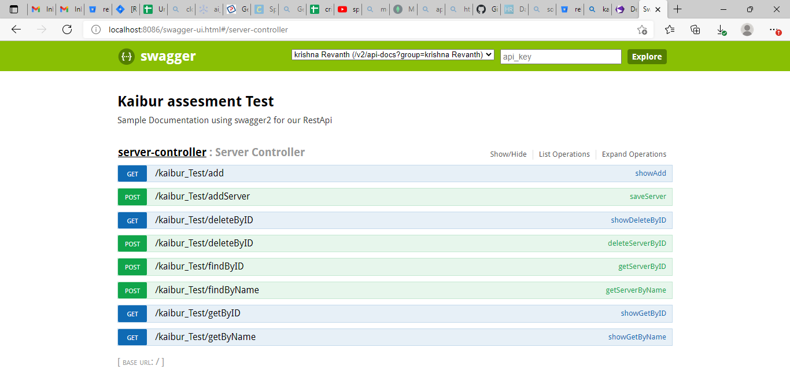

# Kaiburr(krishnaRevanth)

<b>ATTACHED DEMO VIDEO FOR REFERENCE</b> 

<a>href:"https://drive.google.com/file/d/1Q55JF2TnZBb4j8uOQ2NCOabMTpyvlPE8/view?usp=sharing"</a>  

<b>Developed the ui and added updated video for referenece</b> 

<a>href:"https://drive.google.com/file/d/1RLEOK61JK3UOvhbXJFuaTOhiqrsCAZaZ/view?usp=sharing"</a>  

<b>Files:</b> 
<b>Screenshot</b> - It contains the Screenshot of the application. 
<b>Server</b> - It the Spring project with Task 1,4, Task 2,and Task 3, it contains the JAR file and the dockerfile to create the image. 
<b>docker-compose.yml</b> -Contains YML code to compose the setup.  
<b>swagger.yaml</b> - Contains the YAML code. 
  

<b>Dependencies Used</b> 
1. Web 
2. DevTools 
3. Lombook 
4. Swagger 
5. MongoDB 
6. Thymeleaf 

<b>Task 1 & Task 4</b> 
I created the project using Spring Framework and mongoDB is used  for the backend. The endpoints for the project are  
1. /add (Add the details to the database)  
2. /getById (Retrive the data using ID)  
3. /getByName ( Retrive the Data using name)  
4. /deleteById (Delete from the Database using ID)  

The Restfull API's which are beign called were tested using postman. And these are: 
1. /addServer  
2. /findByName  
3. /findByID  
4. /deleteByID  

<b>Controller: /Server/src/main/java/com/spring/test/controller</b> 

<b> Task 2 </b> 
To create the Swagger API is Used the online edittor. And downloaded the code as Server for Spring. But was unable to make it work. So I Have upload the YAML file which I was able to create.  

<b>Screenshot</b> 

  

  
